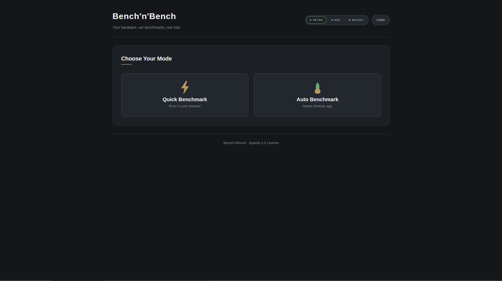
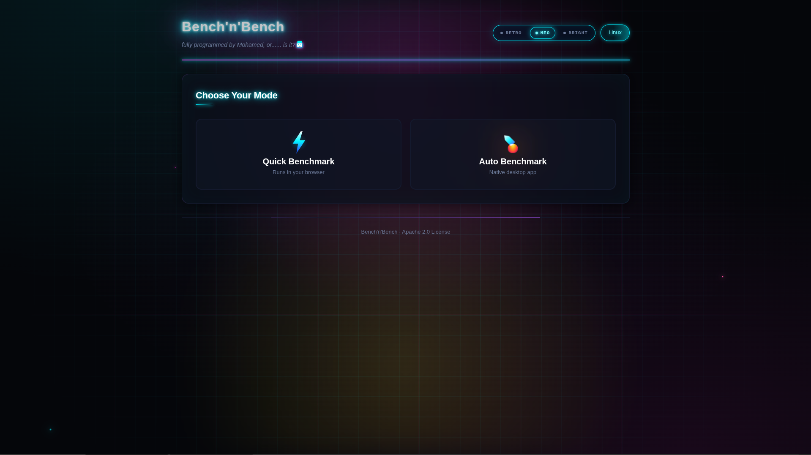

# Bench'n'Bench

> **One tool. all in one.**

Everything a PC user needs for benchmarking — in one place.
Browser-based, retro-styled, and open source.

**Quick Benchmark** · **Auto Benchmark** · **Hybrid Browser**

## Tools at a Glance

| Tool | Platform | Status |

| **Quick Benchmark** | Browser |  Ready |
| **Auto Benchmark** | Desktop (Windows / Linux / macOS) |  In progress |
| **Hybrid Browser** | Browser + Local | In progress |


## Quick Overview

Bench'n'Bench is a **hybrid program** made of **three benchmarking tools**:

### 1. Quick Benchmark

A browser-based tool that provides comparison and stress-test utilities for the fastest benchmarking experience.

**Best for:**
- Testing away from home or outside your usual test environment
- Quick PSU rating
- CPU and GPU performance evaluation
- CPU stress testing to check temperatures
- Verifying whether your power supply will hold under load

### 2. Auto Benchmark

A native desktop application for **Linux, macOS, and Windows** that runs benchmarks automatically with a single user command — fast and effortless.

> **Status:** Currently in development.

### 3. Hybrid Browser

A browser-based tool that communicates with local utilities to fetch data the browser alone cannot access:

- Real temperature monitoring
- GPU stress testing
- Disk health (S.M.A.R.T.) checks
- And more...

**Goal:** Combine **accuracy** with **accessibility** (right from the browser), **simplicity**, and **professionalism**.

> You could say it's **Quick Benchmark + Auto Benchmark** combined.

## Why Bench'n'Bench?

Created by **Mohamed Ibrahim** to gather every tool a user might need into a single place — simple, intuitive, and visually enjoyable, with a retro aesthetic that feels good to use.

- **Easy** for beginners
- **Fast** for professionals
- **Lightweight** for anyone who wants one simple tool that does it all

## Features

- Quick CPU benchmarking directly in the browser
- Real multi-threaded stress testing using Web Workers
- PSU tier rating database
- CPU and GPU comparison
- Disk health checks *(via Hybrid Browser)*
- Temperature monitoring *(via Hybrid Browser)*
- Three visual modes: **Retro**, **Neo**, and **Bright**
- No installation required for Quick Benchmark
- Open source under Apache 2.0

---

## Screenshots

### Retro Mode


### Neo Mode


### Bright Mode


> *Add screenshots to a `screenshots/` folder in the repository to display them here.*


## Tech Stack

- **Frontend:** Vanilla JavaScript, HTML5, CSS3
- **Async:** Web Workers API
- **Data:** Static JSON files (`data/` folder)
- **Graphics:** 2D Canvas API
- **Storage:** localStorage
- **Styling:** Custom CSS with CSS variables for theming


## Getting Started

### Option 1: Use it online

Visit: **https://mohamedibrahim951.github.io/bench-nbench/**

### Option 2: Run locally

```bash
git clone https://github.com/mohamedibrahim951/bench-nbench.git
cd bench-nbench
# Then open index.html in your browser
